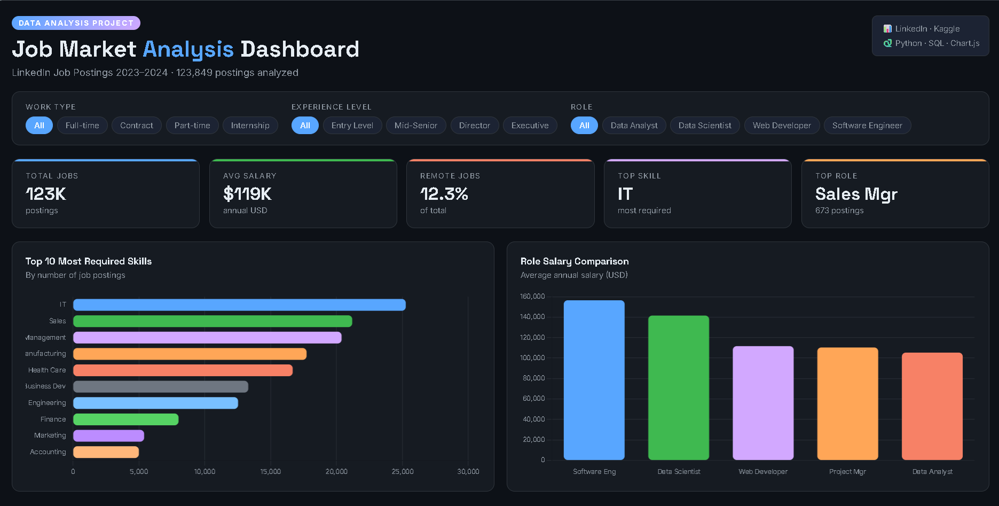
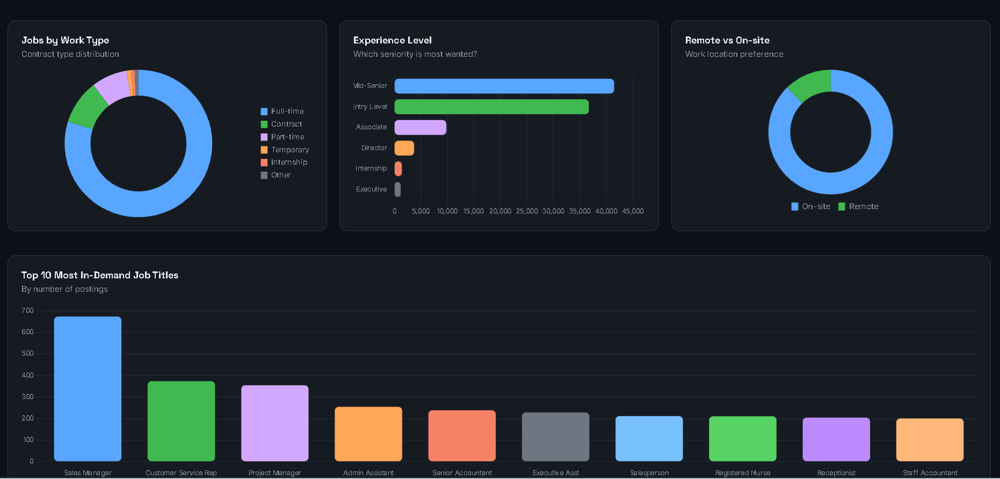

# 📊 Job Market Analysis Dashboard 2023–2024

An end-to-end data analysis project exploring the job market using **123,849 LinkedIn job postings**.

---

## 🖥️ Dashboard Preview





---

## 🎯 Project Goals

- Identify the **most in-demand skills** in the job market
- Compare **salaries** across roles (Data Analyst, Data Scientist, Web Developer, Software Engineer)
- Analyze **job demand** by title, work type, and experience level
- Visualize **remote vs on-site** trends

---

## 🛠️ Tools & Technologies

| Tool | Usage |
|------|-------|
| **Python** | Data cleaning & analysis |
| **Pandas** | Data manipulation |
| **Matplotlib / Seaborn** | Data visualization |
| **SQLite** | Data storage & querying |
| **HTML / CSS / JavaScript** | Interactive dashboard |
| **Chart.js** | Dashboard charts |

---

## 📁 Project Structure
job_market_analysis/

├── data/

│   ├── job_skills.csv

│   ├── salaries.csv

│   └── skills.csv

├── notebooks/

│   ├── 01_exploration.ipynb

│   └── 02_analysis.ipynb

├── output/

│   ├── top_skills.png

│   ├── salary_comparison.png

│   ├── salary_boxplot.png

│   ├── experience_level.png

│   ├── remote_vs_onsite.png

│   ├── work_type.png

│   └── top_jobs.png

├── dashboard/

│   ├── index.html

│   ├── style.css

│   └── charts.js

└── README.md
---

## 📈 Key Findings

- 🥇 **Information Technology** is the most required skill (25,256 postings)
- 💰 **Software Engineers** earn the most on average ($156,472/year)
- 📊 **Data Scientists** average $141,531 vs **Data Analysts** at $105,312
- 🏢 **87.7%** of jobs are on-site, only **12.3%** are remote
- 👔 **Mid-Senior level** roles are most in demand (41,489 postings)
- 🔝 **Sales Manager** is the most posted job title (673 postings)

---

## 🚀 How to Run

### 1. Clone the repo
```bash
git clone https://github.com/Eng-mohamed33/job-market-analysis.git
cd job-market-analysis
```

### 2. Install dependencies
```bash
pip install pandas numpy matplotlib seaborn
```

### 3. Download the dataset
Download from [Kaggle - LinkedIn Job Postings 2023-2024](https://www.kaggle.com/datasets/arshkon/linkedin-job-postings) and place `postings.csv` in the `data/` folder.

### 4. Run the notebooks
Open `notebooks/01_exploration.ipynb` then `02_analysis.ipynb`.

### 5. View the dashboard
```bash
cd dashboard
start index.html
```

---

## 📊 Dataset

- **Source:** [LinkedIn Job Postings 2023-2024](https://www.kaggle.com/datasets/arshkon/linkedin-job-postings)
- **Size:** 123,849 job postings

---

## 👨‍💻 Author

**Mohamed Suleiman** — CS Student @ Helwan University
🔗 [GitHub](https://github.com/Eng-mohamed33)

---

⭐ If you found this project useful, please give it a star!

---
